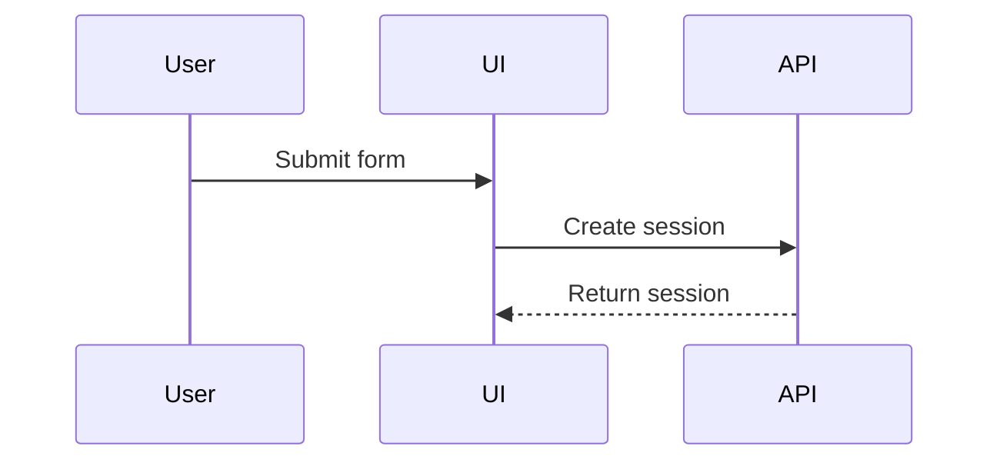

Use a visual when it explains structure, flow, state, or change more clearly than prose. Do not add a visual only for decoration.

## Rules

- Choose the smallest visual that makes the point clear.
- Place each visual next to the text that it supports.
- Introduce its purpose in one sentence.
- Explain any conclusion that is not immediately clear from the visual.

## Choose a format

Match the format to the information:

- Use pseudocode for logic or an algorithm.
- Use a call tree for runtime control flow.
- Use a component tree for user-interface structure and relevant boundaries.
- Use a shallow file tree for file responsibilities or a broad refactor.
- Use Mermaid for interactions, control flow, data flow, or state transitions.
- Use a diff when the existing and proposed shapes are the main point.
- Use a complete code block when most of the content is new or must be copied.

Use multiple formats only when each one answers a different question.

## Keep visuals focused

- Include only relevant calls, files, components, states, and boundaries.
- Use real names, labels, and paths from the system.
- Keep trees shallow and flows directional.
- Put short annotations beside the element they describe.
- Prefer common terminal characters and keep diagrams readable without color.
- Add a short text alternative when a visual contains information that is not available in the surrounding prose.

## Examples

Show an algorithm as pseudocode:

```text
on(save)
  if content is unchanged
    return cached result
  write new content
  return fresh result
```

Show runtime control flow as a call tree:

```text
submitForm
  createSession
    persistPrompt
    launchAgent
  navigateToSession
```

Show user-interface structure as a component tree:

```text
AppShell
├── Sidebar
│   └── SessionList
└── MainPanel
    ├── PromptEditor
    └── RunStatus
```

Show file responsibilities as a shallow tree:

```text
src/
├── commands/
│   ├── parse-action.ts      # parses user input
│   └── execute-action.ts    # dispatches commands
├── sessions/
│   ├── session-store.ts     # persists session state
│   └── session-service.ts   # coordinates session work
└── transport/
    └── api-client.ts        # sends API requests
```

Show interactions with Mermaid:



Show a change as a structural diff:

```diff
 submitForm
   createSession
     persistPrompt
+    expandSkillMention
     launchAgent
-  navigateToSession
+  navigateToSession
+    subscribeToEvents
```

Show new copyable content as a complete code block:

```ts
export function isSessionReady(session: Session): boolean {
  return session.status === "ready" && session.prompt.length > 0;
}
```
